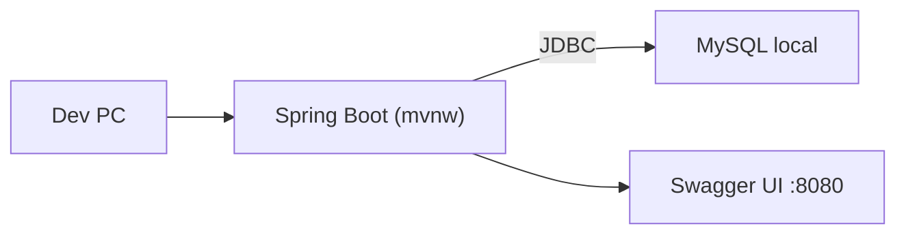
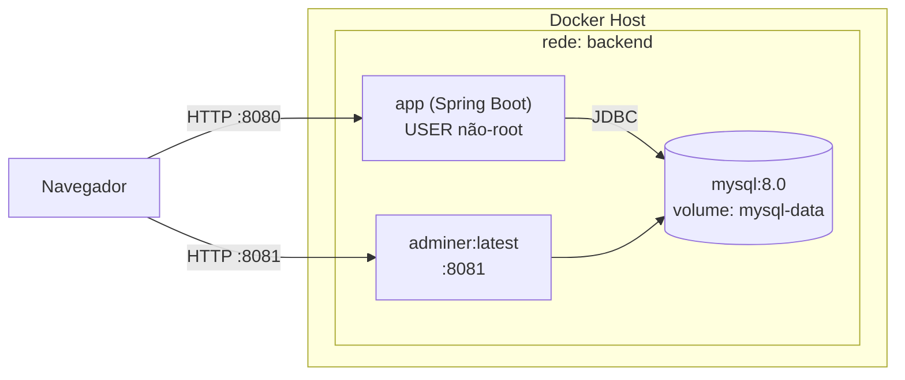

# Green Alert API – Docker Compose

> Projeto: **green-alert-api-1** (Spring Boot + MySQL)  
> Este README foi gerado para o **Checkpoint – Docker Compose** e cobre **arquitetura**, **execução com Docker**, **variáveis de ambiente**, **evidências de CRUD**, **troubleshooting** e **checklist** exigidos.

---

## Sumário
- [Sobre](#sobre)
- [Arquitetura](#arquitetura)
- [Requisitos](#requisitos)
- [Primeiros passos](#primeiros-passos)
  - [Estrutura esperada](#estrutura-esperada)
  - [Arquivo de propriedades (profile docker)](#arquivo-de-propriedades-profile-docker)
  - [Variáveis (.env)](#variáveis-env)
  - [Subir e derrubar a stack](#subir-e-derrubar-a-stack)
- [Acesso rápido](#acesso-rápido)
- [Evidências para o vídeo](#evidências-para-o-vídeo)
- [Troubleshooting](#troubleshooting)
- [Checklist do Checkpoint](#checklist-do-checkpoint)
- [Licença](#licença)

---

## Sobre
API Java/Spring Boot containerizada com **Docker Compose**, utilizando **MySQL 8** como banco de dados.  
Inclui o serviço **Adminer** (opcional) para facilitar a demonstração do CRUD durante a avaliação.

---

## Arquitetura

### Antes do Docker (ambiente local)


### Com Docker Compose (arquitetura alvo)


---

## Requisitos
- **Docker** 24+ e **Docker Compose**
- Portas livres:
  - `8080` → API
  - `8081` → Adminer (opcional)

---

## Primeiros passos

### Estrutura esperada
Os principais arquivos adicionados para a execução via Docker Compose:

```
.
├─ Dockerfile
├─ docker-compose.yml
├─ .env                 # NÃO comitar em repositórios públicos
├─ src/main/resources/
│  └─ application-docker.properties
└─ README.md
```

### Arquivo de propriedades (profile docker)
Crie `src/main/resources/application-docker.properties` com o seguinte conteúdo:

```properties
server.port=${SERVER_PORT:8080}

spring.datasource.url=${SPRING_DATASOURCE_URL}
spring.datasource.username=${SPRING_DATASOURCE_USERNAME}
spring.datasource.password=${SPRING_DATASOURCE_PASSWORD}

spring.jpa.hibernate.ddl-auto=${SPRING_JPA_HIBERNATE_DDL_AUTO:update}
spring.jpa.show-sql=${SPRING_JPA_SHOW_SQL:false}
```

> O profile `docker` será ativado via `SPRING_PROFILES_ACTIVE=docker` no `docker-compose.yml`.

### Variáveis (.env)
Crie um arquivo **.env** na raiz do projeto com valores de exemplo (ajuste conforme necessário):

```dotenv
# MySQL
MYSQL_DATABASE=monitor_tree
MYSQL_USER=app
MYSQL_PASSWORD=app
MYSQL_ROOT_PASSWORD=changeit

# App
APP_PORT=8080
```

> **Importante:** Não comite `.env` com senhas reais.

### Subir e derrubar a stack
Subir com build (primeira vez ou após alterações):
```bash
docker compose up -d --build
```

Verificar serviços:
```bash
docker compose ps
```

Acompanhar logs (API):
```bash
docker compose logs -f app
```

Derrubar tudo:
```bash
docker compose down
```

---

## Acesso rápido

- **API (Swagger UI):**  
  http://localhost:8080/swagger-ui/index.html

- **Adminer (opcional):**  
  http://localhost:8081  
  - **Server:** `db`  
  - **User:** valor de `MYSQL_USER`  
  - **Pass:** valor de `MYSQL_PASSWORD`  
  - **Database:** valor de `MYSQL_DATABASE`

> Caso sua aplicação use **JWT**: faça login no endpoint de autenticação e utilize o token `Bearer` nas chamadas subsequentes.
> Ajuste a seção abaixo para refletir seus endpoints reais.

**Exemplos (ajuste aos seus endpoints):**
```bash
# (Opcional) Login para obter token JWT (exemplo de payload)
TOKEN=$(curl -s -X POST http://localhost:8080/login \
  -H "Content-Type: application/json" \
  -d '{"email":"admin@exemplo.com","password":"1234"}' | sed -E 's/.*"token":"([^"]+)".*/\1/')
echo $TOKEN

# (Opcional) Requisição autenticada
curl -H "Authorization: Bearer $TOKEN" http://localhost:8080/sensores
```

---

## Evidências para o vídeo
Grave um vídeo **com explicação por voz** mostrando:
1. `docker compose up -d --build` até a API responder.
2. Abertura do Swagger UI (`/swagger-ui/index.html`).
3. (Se houver) fluxo de **login/JWT** e chamadas autenticadas.
4. **CRUD completo** em ao menos uma entidade persistida no MySQL (criar, ler, atualizar, deletar).
5. (Opcional) Acesso ao **Adminer** comprovando os dados gravados.

> Inclua no PDF final os **links do GitHub** e do **vídeo** de demonstração, conforme a instrução do checkpoint.

---

## Troubleshooting

**API não responde na 8080**  
- Verifique se a porta 8080 está livre; ou ajuste `APP_PORT` no `.env`.
- Veja `docker compose logs -f app` para possíveis erros de conexão com o banco.

**`app` não conecta no `db`**  
- Aguarde o **healthcheck** do MySQL ficar saudável (`depends_on` com `service_healthy`).
- Confirme `SPRING_DATASOURCE_URL`, `MYSQL_*` no `.env` e permissões do usuário.

**Erro de driver/credenciais**  
- Garanta que a dependência do driver MySQL existe no `pom.xml` e credenciais estão corretas.

**Swagger UI não aparece**  
- Cheque se o Swagger está habilitado no projeto. Como alternativa de sanidade, teste:
  ```bash
  curl -v http://localhost:8080/
  ```
  ou o endpoint de health (se Actuator estiver habilitado):
  ```bash
  curl -s http://localhost:8080/actuator/health
  ```

**Reset total do banco**  
```bash
docker compose down -v   # remove volume mysql-data
docker compose up -d --build
```

---

## Checklist do Checkpoint

- [x] **2+ containers** (app + db; adminer opcional)  
- [x] **Imagens oficiais** (mysql, adminer)  
- [x] **Usuário não-root** no container da aplicação  
- [x] **Healthchecks** (db e app)  
- [x] **Rede** dedicada + **volume** para MySQL  
- [x] **Variáveis de ambiente** e **política de restart**  
- [x] **README** com instalação, uso, comandos e troubleshooting  
- [x] **Vídeo com voz** exibindo `up` → Swagger/JWT → CRUD no banco  
- [x] **PDF `<equipe>-compose.pdf`** com capa, link do **GitHub** e link do **vídeo**

> Observações da banca: utilizar **imagens oficiais**, portar aplicação para **Docker Compose**, e demonstrar **CRUD** persistindo no banco.

---

## Licença
Este projeto segue a licença do repositório original. Caso não exista, considere adotar uma licença como **MIT**.
